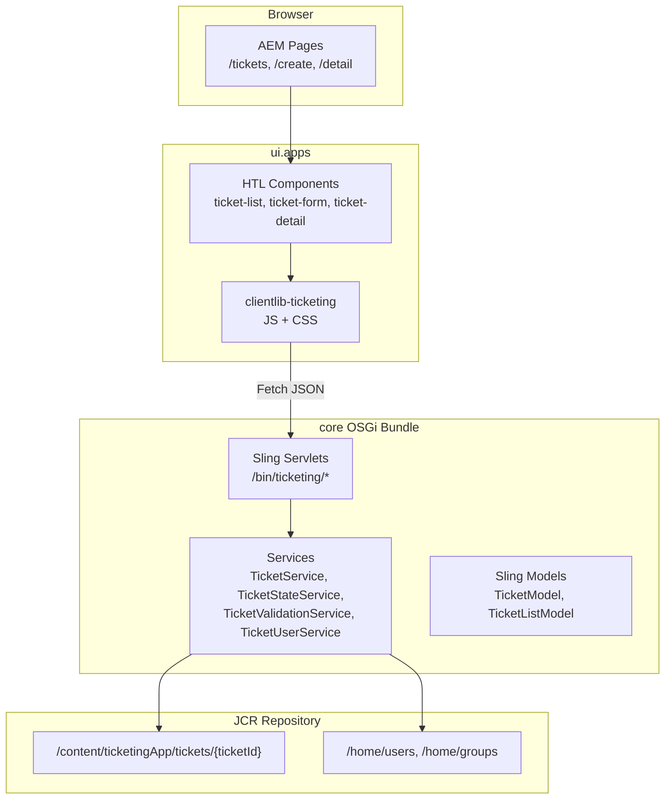

# Design Notes

## Architecture Overview (frontend, backend, database)



| Layer | Technology | Module |
|-------|-----------|--------|
| **Frontend** | HTL templates, vanilla JavaScript, CSS | `ui.apps`, `ui.frontend` |
| **Backend** | Java 8, OSGi, Apache Sling servlets and services | `core` |
| **Database** | JCR (Jackrabbit Oak) content repository | AEM platform |
| **Configuration** | OSGi configs, repoinit scripts | `ui.config` |
| **Content** | Pages, templates, experience fragments | `ui.content` |
| **Deployment** | Maven content packages, dispatcher | `all`, `dispatcher` |

## Frontend Design

### Pattern: HTL Shell + Client-Side Hydration

Server-rendered HTL provides static markup with semantic structure and ARIA attributes. Vanilla JavaScript IIFEs bind to `data-cmp-is` attributes on `DOMContentLoaded`, fetch JSON from Sling servlets, and mutate the DOM. There is no SPA framework.

### Components

| Component | `data-cmp-is` | HTL File | JS File |
|-----------|---------------|----------|---------|
| Ticket List | `ticketList` | `components/ticket-list/ticket-list.html` | `clientlib-ticketing/js/ticket-list.js` |
| Ticket Form | `ticketForm` | `components/ticket-form/ticket-form.html` | `clientlib-ticketing/js/ticket-form.js` |
| Ticket Detail | `ticketDetail` | `components/ticket-detail/ticket-detail.html` | `clientlib-ticketing/js/ticket-detail.js` |

### Clientlib Structure

- **`clientlib-ticketing`** (`ticketingApp.ticketing`): Ticket-specific JS and CSS; depends on `ticketingApp.base`.
- **`clientlib-base`** (`ticketingApp.base`): Embeds Core WCM component clientlibs.
- **`clientlib-site`** (`ticketingApp.site`): Webpack-generated site-wide SCSS from `ui.frontend`.

JS load order: `ticket-csrf.js` → `ticket-list.js` → `ticket-detail.js` → `ticket-form.js`.

### CSRF Handling

All POST requests use `window.TicketingCsrf.postForm()` which:
1. Fetches token from `/libs/granite/csrf/token.json`
2. Sends POST with `Content-Type: application/x-www-form-urlencoded` and `CSRF-Token` header

### UI Styling

Ticket UI uses hand-written CSS in `clientlib-ticketing/css/ticketing.css` with Jira-inspired design tokens (CSS custom properties for colors, spacing, badges). Site-wide Core Component styling is handled separately via Webpack/SCSS in `ui.frontend`.

### User Flows

1. **List** — Load all tickets; debounced keyword search (400ms); instant filter on status/priority dropdown change; card click navigates to detail.
2. **Create** — Load assignees; auto-fill reporter; client validation; POST create; redirect to detail on success.
3. **Detail** — Load ticket by `ticketPath` query param; show status action buttons based on allowed transitions; inline edit form (hidden for terminal states); add comments.

## Backend Design

### Service Layer

| Service | Responsibility |
|---------|---------------|
| `TicketService` / `TicketServiceImpl` | CRUD operations, search via QueryBuilder, comment append, status change orchestration |
| `TicketStateService` / `TicketStateServiceImpl` | Finite state machine for status transitions |
| `TicketValidationService` / `TicketValidationServiceImpl` | Field-level validation for create and update |
| `TicketUserService` / `TicketUserServiceImpl` | Resolve assignable users from AEM groups via service subservice resolver |

### Servlet Layer (Thin Controllers)

Each servlet handles HTTP method routing, parameter extraction, delegation to services, and HTTP status/JSON response mapping. Servlets do not contain business logic.

### State Machine

Defined in `TicketStateServiceImpl` as an immutable `EnumMap`:

```
OPEN        → { IN_PROGRESS, CANCELLED }
IN_PROGRESS → { RESOLVED, CANCELLED }
RESOLVED    → { CLOSED }
CLOSED      → { } (terminal)
CANCELLED   → { } (terminal)
```

Invalid transitions throw `IllegalStateException`, mapped to HTTP 409 by the servlet.

### Search Implementation

Uses AEM `QueryBuilder` with predicates:
- Path: `/content/ticketingApp/tickets`
- Type: nodes where `ticketId` property exists
- Optional filters: `status`, `priority`
- Keyword: OR group with LIKE on `title` and `description`
- Order: `@created` descending, no limit

### Authentication

`TicketingAuthenticationRequirements` OSGi component registers Sling auth requirements for:
- `+/content/ticketingApp/us/en/tickets`
- `+/bin/ticketing`

## Database Design

There is no external database. Tickets are stored as JCR nodes.

### Storage Root

```
/content/ticketingApp/tickets/
└── TKT-AB12CD34/          ← nt:unstructured node (node name = ticket ID)
    ├── ticketId           ← String
    ├── title              ← String
    ├── description        ← String
    ├── priority           ← String (LOW | MEDIUM | HIGH | CRITICAL)
    ├── status             ← String (OPEN | IN_PROGRESS | RESOLVED | CLOSED | CANCELLED)
    ├── assignee           ← String (AEM user ID)
    ├── reporter           ← String (AEM user ID)
    ├── created            ← Calendar
    ├── updated            ← Calendar
    ├── comments           ← String[] (each entry is JSON CommentModel)
    └── statusHistory      ← String[] (each entry is JSON StatusHistoryModel)
```

### JSON Property Schemas

**CommentModel:**
```json
{ "author": "user-id", "body": "comment text", "created": 1690000000000 }
```

**StatusHistoryModel:**
```json
{ "user": "user-id", "from": "OPEN", "to": "IN_PROGRESS", "created": 1690000000000 }
```

### ACLs (Repoinit)

| Principal | `/content/ticketingApp/tickets` |
|-----------|----------------------------------|
| `anonymous` | deny read |
| `ticketing-qa` | read, addChildNodes, modifyProperties |
| `ticketing-developers` | read, modifyProperties; deny addChildNodes |
| `ticketing-user-reader` (service) | read on `/home/users`, `/home/groups` |

## Validation Strategy

### Server-Side (`TicketValidationServiceImpl`)

| Field | Create | Update |
|-------|--------|--------|
| Title | Required, max 200 chars | Required, max 200 chars |
| Description | Required, max 5000 chars | Required, max 5000 chars |
| Priority | Required, valid enum | Valid enum if provided |
| Assignee | Required, must be assignable user | Validated separately if provided |
| Reporter | Required (from session) | N/A |

Assignee validation uses `TicketUserService.isAssignableUser()` — checks membership in `ticketing-qa` or `ticketing-developers`.

### Client-Side

Mirrors server rules in:
- `ticket-form.js` — create form validation before POST
- `ticket-detail.js` — edit form validation before update POST

Client validation provides immediate feedback; server validation is authoritative.

## Error Handling Strategy

### HTTP Status Mapping

| Condition | Status | Response |
|-----------|--------|----------|
| Missing/invalid params | 400 | `{ "error": "<message>" }` |
| Validation failure | 400 | `{ "error": "<validation message>" }` |
| Ticket not found | 404 | `{ "error": "Ticket not found: <path>" }` |
| Invalid status transition | 409 | `{ "error": "Cannot transition from X to Y" }` |
| Server/persistence error | 500 | `{ "error": "Failed to ...: <message>" }` |
| Successful create | 201 | `{ "success": true, "path", "ticketId" }` |
| Successful comment | 201 | `{ "success": true, "ticketPath", "author" }` |
| Successful update/status | 200 | `{ "success": true, ... }` |

### Frontend Error Display

- Inline error banners for general API failures
- Field-level validation messages on forms
- Status transition errors (409) shown with specific messaging
- Loading states and empty states for list/detail views

### Resilience

- Malformed JSON in stored `comments` or `statusHistory` properties is logged as a warning and skipped during parse — the ticket still loads with valid entries.

## Testing Strategy Link

See [test-strategy.md](test-strategy.md) for detailed test scope, frameworks, and coverage inventory.
